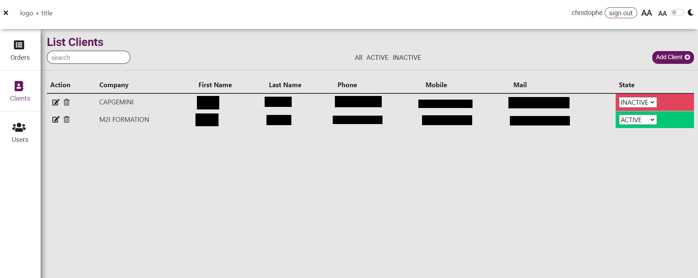
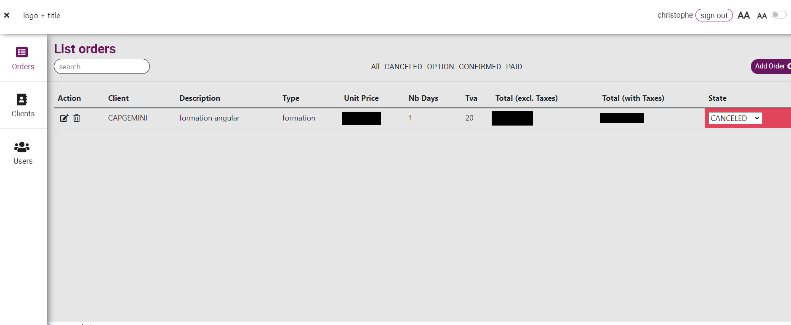

# Projet fil rouge CRM

---

## Ressources

- [Icônes](https://icones.js.org/)
- [Polices](https://fonts.google.com/)
- [images](https://unsplash.com/)
- [Extraire les couleurs à partir d'une image](https://color.adobe.com/fr/create/image)
- [Couleurs](https://color.adobe.com/fr/create/color-wheel)
- [Logo (entrez un nom ou vos initiales et choisissez un modèle)](https://www.freelogodesign.org/)

---

## Modalités

1. Travaillez avec le cadre *SCRUM* : 
- Invitez le formateur au projet (`contact@tshimini.fr`)
- Déterminez vos *Definition of ready (DoR)* et *Definition of done (DoD)* ;
- Constituez votre *backlog* en fonction des besoins et les attentes ;
- Planifiez le(s) *sprint(s)* en estimant à chaque fois la complexité de votre *sprint backlog* ;
- Déterminez votre(vos) plan(s) d'action.

2. Intégrez l'approche *UX Design* :
- Adoptez une approche (partielle ou totale selon votre compréhension du besoin et/ou par rapport aux informations mis à votre disposition) **Design Thinking** dans votre démarche centrée sur les utilisateurs finaux ;
- Utilisez les autres concepts d'*UX Design* et *UI* ;
- Appliquez le *Mobile First* et le *Responsive Design* ;

3. Utilisez le langage HTML 5 et le préprocesseur *SASS* pour la réalisation de vos pages web.
4. Versionnez votre code avec *GitLab* (invitez le formateur au projet `contact@tshimini.fr`).

---

## Expression des besoins du client

Le client souhaite une version web de son application [CRM](https://www.salesforce.com/fr/learning-centre/crm/what-is-crm/).

Ci-après, l'application actuelle sur logiciel. Le client ne souhaite pas développer la partie consacrée aux utilisateurs (*users*) dans la version web, cependant la partie authentification doit être conservée.

---

